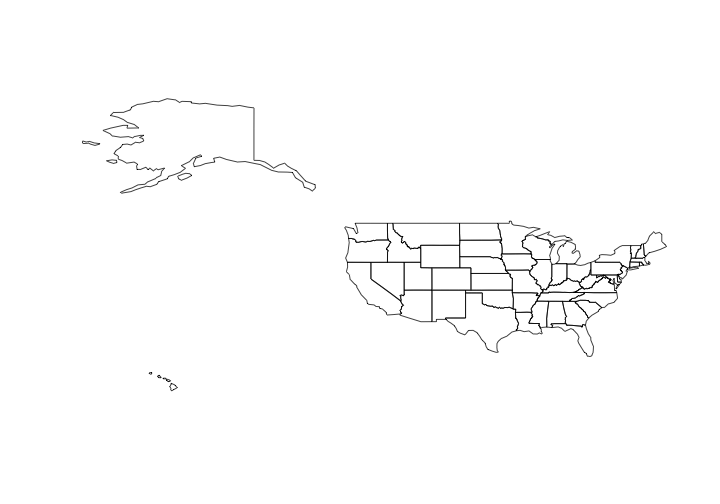

geojsonio
=========


[](https://travis-ci.org/ropensci/geojsonio)
[](https://coveralls.io/r/ropensci/geojsonio)
[](https://github.com/metacran/cranlogs.app)
[](http://cran.rstudio.com/web/packages/geojsonio)

__Convert various data formats to geoJSON or topoJSON__

This package is a utility to convert geographic data to geojson and topojson formats. Nothing else. We hope to do this one job very well, and handle all reasonable use cases.

Functions in this package are organized first around what you're working with or want to get, geojson or topojson, then convert to or read from various formats:

* `geojson_list()` - convert to geojson/topojson as R list format
* `geojson_json()` - convert to geojson/topojson as json
* `geojson_read()`/`topojson_read()` - read a geojson/topojson file from file path or URL
* `geojson_write()` - write a geojson file locally (topojson coming later)

Each of the above functions have methods for various objects/classes, including `numeric`, `data.frame`, `list`, `SpatialPolygons`, `SpatialLines`, `SpatialPoints`, etc.

Additional functions:

* `map_gist()` - push up a geojson or topojson file as a GitHub gist (renders as an interactive map)

## *json Info

* GeoJSON - [spec](http://geojson.org/geojson-spec.html)
* [GeoJSON lint](http://geojsonlint.com/)
* TopoJSON - [spec](https://github.com/topojson/topojson-specification/blob/master/README.md)

## Quick start

### Install

A note about installing `rgdal` and `rgeos` - these two packages are built on top of C libraries, and their installation often causes trouble for Mac and Linux users because no binaries are provided on CRAN for those platforms. Other dependencies in `geojsonio` should install easily automatically when you install `geojsonio`. Change to the version of `rgdal` and `GDAL` you have):

_Mac_

Install `GDAL` on the command line first, e.g., usingn `homebrew`

```
brew install gdal
```

Then install `rgdal` and `rgeos`


```r
install.packages("rgdal", type = "source", configure.args = "--with-gdal-config=/Library/Frameworks/GDAL.framework/Versions/1.11/unix/bin/gdal-config --with-proj-include=/Library/Frameworks/PROJ.framework/unix/include --with-proj-lib=/Library/Frameworks/PROJ.framework/unix/lib")
install.packages("rgeos", type = "source")
```

_Linux_

Get deps first

```
sudo apt-get install libgdal1-dev libgdal-dev libgeos-c1 libproj-dev
```

Then install `rgdal` and `rgeos`


```r
install.packages("rgdal", type = "source")
install.packages("rgeos", type = "source")
```

__Install geojsonio__

Stable version from CRAN


```r
install.packages("geojsonio")
```

Or development version from GitHub


```r
install.packages("devtools")
devtools::install_github("ropensci/geojsonio")
```


```r
library("geojsonio")
```

### GeoJSON

#### Convert various formats to geojson

From a `numeric` vector of length 2, as json or list


```r
geojson_json(c(32.45, -99.74))
#> {"type":"FeatureCollection","features":[{"type":"Feature","geometry":{"type":"Point","coordinates":[32.45,-99.74]},"properties":{}}]}
```


```r
geojson_list(c(32.45, -99.74))
#> $type
#> [1] "FeatureCollection"
#> 
#> $features
#> $features[[1]]
#> $features[[1]]$type
#> [1] "Feature"
#> 
#> $features[[1]]$geometry
#> $features[[1]]$geometry$type
...
```

From a `data.frame`


```r
library('maps')
data(us.cities)
geojson_json(us.cities[1:2, ], lat = 'lat', lon = 'long')
#> {"type":"FeatureCollection","features":[{"type":"Feature","geometry":{"type":"Point","coordinates":[-99.74,32.45]},"properties":{"name":"Abilene TX","country.etc":"TX","pop":"113888","capital":"0"}},{"type":"Feature","geometry":{"type":"Point","coordinates":[-81.52,41.08]},"properties":{"name":"Akron OH","country.etc":"OH","pop":"206634","capital":"0"}}]}
```


```r
geojson_list(us.cities[1:2, ], lat = 'lat', lon = 'long')
#> $type
#> [1] "FeatureCollection"
#> 
#> $features
#> $features[[1]]
#> $features[[1]]$type
#> [1] "Feature"
#> 
#> $features[[1]]$geometry
#> $features[[1]]$geometry$type
...
```

From `SpatialPolygons` class


```r
library('sp')
poly1 <- Polygons(list(Polygon(cbind(c(-100, -90, -85, -100),
  c(40, 50, 45, 40)))), "1")
poly2 <- Polygons(list(Polygon(cbind(c(-90, -80, -75, -90),
  c(30, 40, 35, 30)))), "2")
sp_poly <- SpatialPolygons(list(poly1, poly2), 1:2)
```

to json


```r
geojson_json(sp_poly)
#> {"type":"FeatureCollection","features":[{"type":"Feature","id":1,"properties":{"dummy":0},"geometry":{"type":"Polygon","coordinates":[[[-100,40],[-90,50],[-85,45],[-100,40]]]}},{"type":"Feature","id":2,"properties":{"dummy":0},"geometry":{"type":"Polygon","coordinates":[[[-90,30],[-80,40],[-75,35],[-90,30]]]}}]}
```

to list


```r
geojson_list(sp_poly)$features[[1]]
#> $type
#> [1] "Feature"
#> 
#> $id
#> [1] 1
#> 
#> $properties
#> $properties$dummy
#> [1] 0
#> 
...
```

#### Combine objects

`geo_list` + `geo_list`

> Note: `geo_list` is the output type from `geojson_list()`, it's just a list with a class attached so we know it's geojson :)


```r
vec <- c(-99.74, 32.45)
a <- geojson_list(vec)
vecs <- list(c(100.0, 0.0), c(101.0, 0.0), c(100.0, 0.0))
b <- geojson_list(vecs, geometry = "polygon")
a + b
#> $type
#> [1] "FeatureCollection"
#> 
#> $features
#> $features[[1]]
#> $features[[1]]$type
#> [1] "Feature"
#> 
#> $features[[1]]$geometry
#> $features[[1]]$geometry$type
...
```

`json` + `json`


```r
c <- geojson_json(c(-99.74, 32.45))
vecs <- list(c(100.0, 0.0), c(101.0, 0.0), c(101.0, 1.0), c(100.0, 1.0), c(100.0, 0.0))
d <- geojson_json(vecs, geometry = "polygon")
c + d
#> {"type":"FeatureCollection","features":[{"type":"Feature","geometry":{"type":"Point","coordinates":[-99.74,32.45]},"properties":{}},{"type":"Feature","geometry":{"type":"Polygon","coordinates":[[[100,0],[101,0],[101,1],[100,1],[100,0]]]},"properties":[]}]}
```

#### Write geojson


```r
library('maps')
data(us.cities)
geojson_write(us.cities[1:2, ], lat = 'lat', lon = 'long')
#> <geojson>
#>   Path:       myfile.geojson
#>   From class: data.frame
```

#### Read geojson


```r
file <- system.file("examples", "california.geojson", package = "geojsonio")
out <- geojson_read(file)
```

### TopoJSON

#### Read topojson

TopoJSON


```r
library("sp")
url <- "https://raw.githubusercontent.com/shawnbot/d3-cartogram/master/data/us-states.topojson"
out <- topojson_read(url)
#> OGR data source with driver: GeoJSON 
#> Source: "https://raw.githubusercontent.com/shawnbot/d3-cartogram/master/data/us-states.topojson", layer: "states"
#> with 51 features
#> It has 2 fields
plot(out)
```

 

## Meta

* [Please report any issues or bugs](https://github.com/ropensci/geojsonio/issues).
* License: MIT
* Get citation information for `geojsonio` in R doing `citation(package = 'geojsonio')`

[](http://ropensci.org)
