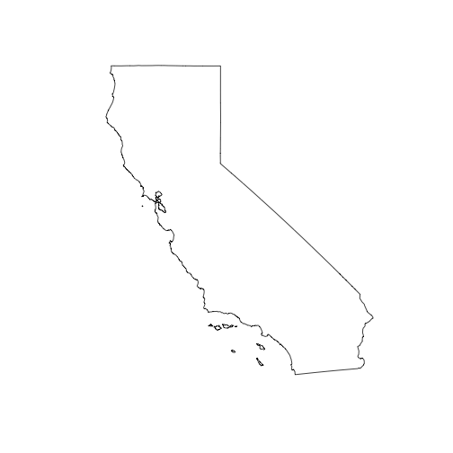

<!--
%\VignetteEngine{knitr::knitr}
%\VignetteIndexEntry{geojsonio vignette}
-->


gistr vignette
==============

`geojsonio` converts geographic data to geojson and topojson formats. Nothing else. We hope to do this one job very well, and handle all reasonable use cases.

Functions in this package are organized first around what you're working with or want to get, geojson or topojson, then convert to or read from various formats:

* `geojson_list()`/`topojson_list()` - convert to geojson/topojson as R list format
* `geojson_json()`/`topojson_json()` - convert to geojson/topojson as json
* `geojson_read()``topojson_read()` - read a geojson/topojson file from file path or URL
* `geojson_write()`/`topojson_write()` - write a geojson/topojson file locally

Each of the above functions have methods for various objects/classes, including `numeric`, `data.frame`, `list`, `SpatialPolygons`, `SpatialLines`, `SpatialPoints`, etc.

Additional functions:

* `map_gist()` - push up a geojson or topojson file as a GitHub gist (renders as an interactive map)

## Install

Install rgdal - in case you can't get it installed from binary , here's what works on a Mac (change to the version of `rgdal` and `GDAL` you have).


```r
install.packages("http://cran.r-project.org/src/contrib/rgdal_0.9-1.tar.gz", repos = NULL, type="source", configure.args = "--with-gdal-config=/Library/Frameworks/GDAL.framework/Versions/1.11/unix/bin/gdal-config --with-proj-include=/Library/Frameworks/PROJ.framework/unix/include --with-proj-lib=/Library/Frameworks/PROJ.framework/unix/lib")
```

Stable version from CRAN


```r
install.packages("geojsonio")
```

Development version from GitHub


```r
devtools::install_github("ropensci/geojsonio")
```


```r
library("geojsonio")
```

## GeoJSON

### Convert various formats to geojson

From a `numeric` vector of length 2, as json or list


```r
geojson_json(c(32.45, -99.74))
```

```
#> {"type":"FeatureCollection","features":[{"type":"Feature","geometry":{"type":"Point","coordinates":[32.45,-99.74]},"properties":{}}]}
```

```r
geojson_list(c(32.45, -99.74))
```

```
#> $type
#> [1] "FeatureCollection"
#> 
#> $features
#> $features[[1]]
#> $features[[1]]$type
#> [1] "Feature"
#> 
#> $features[[1]]$geometry
#> $features[[1]]$geometry$type
#> [1] "Point"
#> 
#> $features[[1]]$geometry$coordinates
#> [1]  32.45 -99.74
#> 
#> 
#> $features[[1]]$properties
#> NULL
#> 
#> 
#> 
#> attr(,"class")
#> [1] "geo_list"
#> attr(,"from")
#> [1] "numeric"
```

From a `data.frame`


```r
library('maps')
data(us.cities)
geojson_json(us.cities[1:2, ], lat = 'lat', lon = 'long')
```

```
#> {"type":"FeatureCollection","features":[{"type":"Feature","geometry":{"type":"Point","coordinates":[-99.74,32.45]},"properties":{"name":"Abilene TX","country.etc":"TX","pop":"113888","capital":"0"}},{"type":"Feature","geometry":{"type":"Point","coordinates":[-81.52,41.08]},"properties":{"name":"Akron OH","country.etc":"OH","pop":"206634","capital":"0"}}]}
```

```r
geojson_list(us.cities[1:2, ], lat = 'lat', lon = 'long')
```

```
#> $type
#> [1] "FeatureCollection"
#> 
#> $features
#> $features[[1]]
#> $features[[1]]$type
#> [1] "Feature"
#> 
#> $features[[1]]$geometry
#> $features[[1]]$geometry$type
#> [1] "Point"
#> 
#> $features[[1]]$geometry$coordinates
#> [1] -99.74  32.45
#> 
#> 
#> $features[[1]]$properties
#> $features[[1]]$properties$name
#> [1] "Abilene TX"
#> 
#> $features[[1]]$properties$country.etc
#> [1] "TX"
#> 
#> $features[[1]]$properties$pop
#> [1] "113888"
#> 
#> $features[[1]]$properties$capital
#> [1] "0"
#> 
#> 
#> 
#> $features[[2]]
#> $features[[2]]$type
#> [1] "Feature"
#> 
#> $features[[2]]$geometry
#> $features[[2]]$geometry$type
#> [1] "Point"
#> 
#> $features[[2]]$geometry$coordinates
#> [1] -81.52  41.08
#> 
#> 
#> $features[[2]]$properties
#> $features[[2]]$properties$name
#> [1] "Akron OH"
#> 
#> $features[[2]]$properties$country.etc
#> [1] "OH"
#> 
#> $features[[2]]$properties$pop
#> [1] "206634"
#> 
#> $features[[2]]$properties$capital
#> [1] "0"
#> 
#> 
#> 
#> 
#> attr(,"class")
#> [1] "geo_list"
#> attr(,"from")
#> [1] "data.frame"
```

From `SpatialPolygons` class


```r
library('sp')
poly1 <- Polygons(list(Polygon(cbind(c(-100,-90,-85,-100),
  c(40,50,45,40)))), "1")
poly2 <- Polygons(list(Polygon(cbind(c(-90,-80,-75,-90),
  c(30,40,35,30)))), "2")
sp_poly <- SpatialPolygons(list(poly1, poly2), 1:2)
```

to json


```r
geojson_json(sp_poly)
```

```
#> {"type":"FeatureCollection","features":[{"type":"Feature","id":1,"properties":{"dummy":0},"geometry":{"type":"Polygon","coordinates":[[[-100,40],[-90,50],[-85,45],[-100,40]]]}},{"type":"Feature","id":2,"properties":{"dummy":0},"geometry":{"type":"Polygon","coordinates":[[[-90,30],[-80,40],[-75,35],[-90,30]]]}}]}
```

to list


```r
geojson_list(sp_poly)$coordinates[[1]]
```

```
#> NULL
```

### Write geojson


```r
library('maps')
data(us.cities)
geojson_write(us.cities[1:2, ], lat = 'lat', lon = 'long')
```

```
#> [1] "myfile.geojson"
```

### Read geojson


```r
file <- system.file("examples", "california.geojson", package = "geojsonio")
out <- geojson_read(file)
```

```
#> OGR data source with driver: GeoJSON 
#> Source: "/Users/sacmac/github/ropensci/geojsonio/inst/examples/california.geojson", layer: "OGRGeoJSON"
#> with 1 features and 11 fields
#> Feature type: wkbMultiPolygon with 2 dimensions
```

```r
plot(out)
```

 

## Topojson


```r
"Asdfasdf"
```

```
#> [1] "Asdfasdf"
```

## Example use case: Play with US states

Using data from [https://github.com/glynnbird/usstatesgeojson](https://github.com/glynnbird/usstatesgeojson)

Get some geojson


```r
library('httr')
res <- GET('https://api.github.com/repos/glynnbird/usstatesgeojson/contents')
st_names <- Filter(function(x) grepl("\\.geojson", x), sapply(content(res), "[[", "name"))
base <- 'https://raw.githubusercontent.com/glynnbird/usstatesgeojson/master/'
st_files <- paste0(base, st_names)
```

Make a faceted plot


```r
library('ggplot2')
library('plyr')
st_use <- st_files[7:13]
geo <- lapply(st_use, geojson_read, verbose = FALSE)
df <- ldply(setNames(lapply(geo, fortify), gsub("\\.geojson", "", st_names[7:13])))
ggplot(df, aes(long, lat, group = group)) +
  geom_polygon() +
  facet_wrap(~ .id, scales = "free")
```

 
